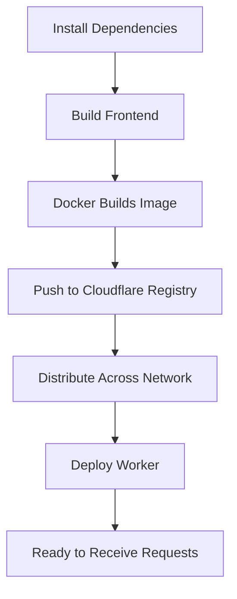

# Cloudflare Container Deployment - Quick Reference

## Prerequisites Checklist

- [ ] Cloudflare account with "Containers: Edit" permission
- [ ] Cloudflare account with "Workers Scripts: Edit" permission  
- [ ] Docker installed and running locally
- [ ] Node.js and pnpm installed
- [ ] Repository cloned locally

## Environment Setup

```bash
# Set Cloudflare credentials (choose one method)

# Method 1: Login with browser
npx wrangler login

# Method 2: Set environment variables
export CF_API_TOKEN="your-api-token"
export CF_ACCOUNT_ID="your-account-id"

# Method 3: Set secrets (for production)
npx wrangler secret put CF_API_TOKEN
npx wrangler secret put CF_ACCOUNT_ID
```

## Deployment Commands

### One-Line Deploy (Quick Start)

```bash
npm create cloudflare@latest -- --template=cloudflare/templates/containers-template
```

### Standard Deployment

```bash
# 1. Install dependencies
pnpm install --frozen-lockfile

# 2. Build application
pnpm run build

# 3. Deploy
npm run deploy:cloudflare           # Default
npm run deploy:cloudflare:prod      # Production
npm run deploy:cloudflare:staging   # Staging
```

### Using Wrangler Directly

```bash
npx wrangler deploy                 # Default
npx wrangler deploy --env production
npx wrangler deploy --env staging
```

## Testing & Verification

```bash
# Local development
npx wrangler dev

# Health check (replace URL with your deployment)
curl https://mighty-agent.YOUR_ACCOUNT.workers.dev/__health
curl https://mighty-agent.YOUR_ACCOUNT.workers.dev/__container_health
```

## Common Issues & Solutions

### Issue: Build fails - Docker not running
**Solution**: Start Docker Desktop and ensure it's running

### Issue: Permission denied
**Solution**: Verify account has "Containers: Edit" and "Workers Scripts: Edit" permissions

### Issue: Container not responding
**Solution**: Wait 2-3 minutes after first deployment for container initialization

### Issue: Environment variables not set
**Solution**: Check `cloudflare/worker/index.ts` for required variables and set them in wrangler.toml or as secrets

## Configuration Files

| File | Purpose |
|------|---------|
| `wrangler.toml` | Main Worker configuration |
| `Dockerfile.cloudflare` | Container image definition |
| `cloudflare/worker/index.ts` | Worker & Container implementation |
| `package.json` | Build and deploy scripts |

## Key Configuration Values

```toml
# wrangler.toml
[containers]
image = "mighty-agent:latest"
build = { context = ".", dockerfile = "Dockerfile.cloudflare" }

[containers.resources]
cpu = 2
memory = "10Gi"

[[durable_objects.bindings]]
name = "MIGHTY_AGENT_CONTAINER"
class_name = "MightyAgentContainer"
```

## Environment Variables

### Required for Container
- `CF_ACCOUNT_ID` - Your Cloudflare account ID
- `CF_API_TOKEN` - Your Cloudflare API token
- `CF_AI_USE=true` - Enable Cloudflare AI

### Optional Model Configuration
- `CF_AI_MODEL` - Default AI model
- `CF_*_MODEL` - Specific model configurations (see worker/index.ts)

## Deployment Workflow



## Useful Commands

```bash
# Check deployment status
npx wrangler deployments list

# View logs
npx wrangler tail

# View container logs
npx wrangler tail --format json | jq '.logs[]'

# Delete deployment
npx wrangler delete

# Check account info
npx wrangler whoami
```

## Container Routing Patterns

### Single Instance (Singleton)
```typescript
const id = env.MIGHTY_AGENT_CONTAINER.idFromName('singleton');
const container = env.MIGHTY_AGENT_CONTAINER.get(id);
```

### Per-Session Instances
```typescript
const sessionId = request.headers.get("session-id");
const id = env.MIGHTY_AGENT_CONTAINER.idFromName(sessionId);
const container = env.MIGHTY_AGENT_CONTAINER.get(id);
```

### Load Balanced
```typescript
import { getRandom } from "@cloudflare/containers";
const container = await getRandom(env.MIGHTY_AGENT_CONTAINER, 3);
```

## Resources & Links

- 📚 [Full Documentation](./CLOUDFLARE_CONTAINERS.md)
- 🏠 [Project README](../README.md)
- 🔧 [Cloudflare Workers Docs](https://developers.cloudflare.com/workers/)
- 📦 [Containers on Workers](https://developers.cloudflare.com/workers/runtime-apis/containers/)
- 🤖 [Workers AI Models](https://developers.cloudflare.com/workers-ai/models/)

## CI/CD Integration

GitHub Actions workflow is configured at `.github/workflows/deploy-cloudflare.yml`

**Required Secrets:**
- `CF_API_TOKEN`
- `CF_ACCOUNT_ID`
- `CF_ZONE_ID` (optional)

**Triggers:**
- Push to main/master branch
- Manual workflow dispatch
- Pull requests (build only)
